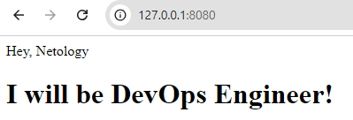
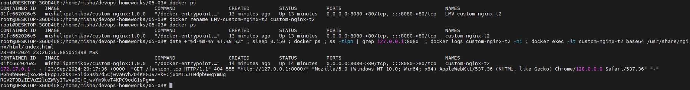

### Задача 1, 2
Образ в docker hub  
`https://hub.docker.com/repository/docker/mishalipatnikov/custom-nginx/general`

1. Сборка образа с помошью Dockerfile  
`docker build -t custom-nginx:1.0.0 .`
2. Ставим tag для hub'а  
`docker tag custom-nginx:1.0.0 mishalipatnikov/custom-nginx:1.0.0`
3. Пушим образ в hub  
`docker push mishalipatnikov/custom-nginx:1.0.0`
4. Запуск контейнера  
`docker run --name LMV-custom-nginx-t2 -p 8080:80 -d mishalipatnikov/custom-nginx:1.0.0`
5. 
6. Переименовать контейнер  
`docker rename LMV-custom-nginx-t2 custom-nginx-t2`
7. Вывод команд  
