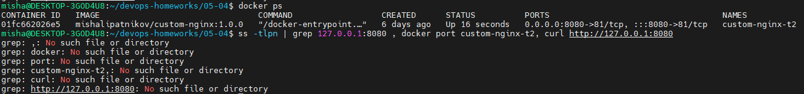
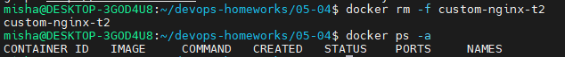
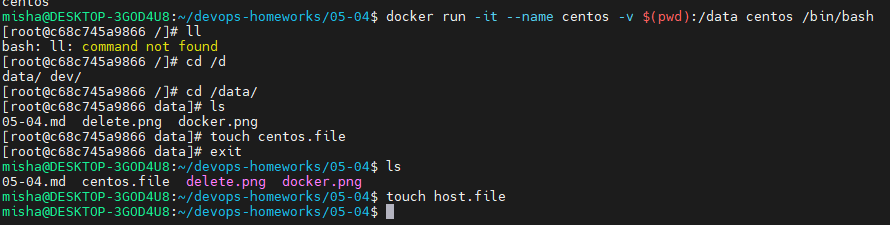
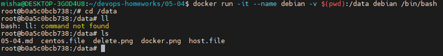
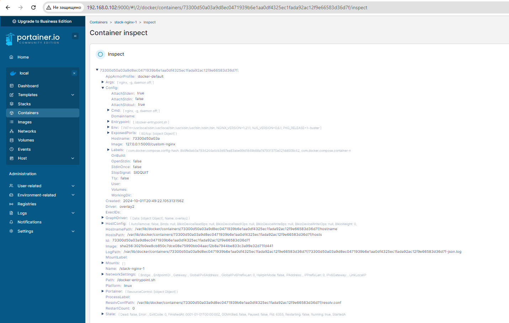
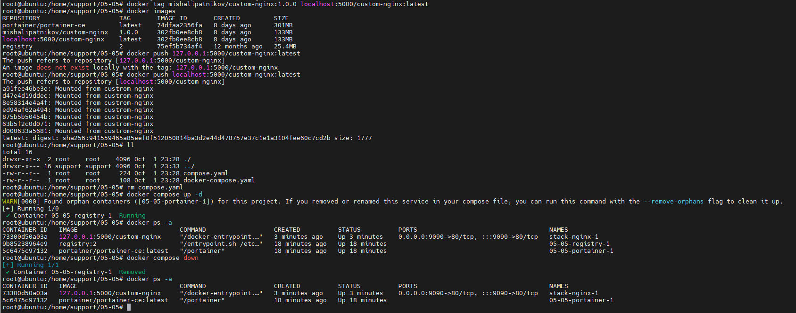

### Задача 3

1. Мы подключились к стандартному потоку ввода и вывода контейнера, комбинация клавиш "ctrl + C" в Linux прерывает процессы, так что скорее всего для контейнеров эту комбинацию использовали, как аналогичную.
2. Изначально по умолчанию сайт висел на 80 порту, его мы и перенаправляли из контейнера на хост на порт 8080, в nginx настройка сменилась, а
в настройках хоста нет.
3. 
Я исправил в настройках контейнера в папке '/var/lib/docker/containers/id' файл config.v2.json, поменял порт 80 на 81, и это видно на скрине, но почему-то не завелось после полного перезапуска docker и контейнера
4. Удалить было просто с помощью 'docker rm -f custom-nginx-t2'



### Задача 4
1. Создание контейнеров, сразу зашел в них, открыл в параллельных вкладках  
`docker run -it --name centos -v $(pwd):/data centos /bin/bash`  
`docker run -it --name debian -v $(pwd):/data debian /bin/bash`
2.   
  

### Задача 5
1. Запустился `compose.yaml`, как более поздняя версия поддерживаемого файла
2. ```
   include: 
   - docker-compose.yaml
   ```
3.  Скачать образ из репозитория, поставить тег в локальном registry и потом уже запушить его туда  
    ```
    docker pull mishalipatnikov/custom-nginx:1.0.0  
    docker tag mishalipatnikov/custom-nginx:1.0.0 localhost:5000/custom-nginx:latest  
    docker push localhost:5000/custom-nginx:latest
    ```
4.   
5.   