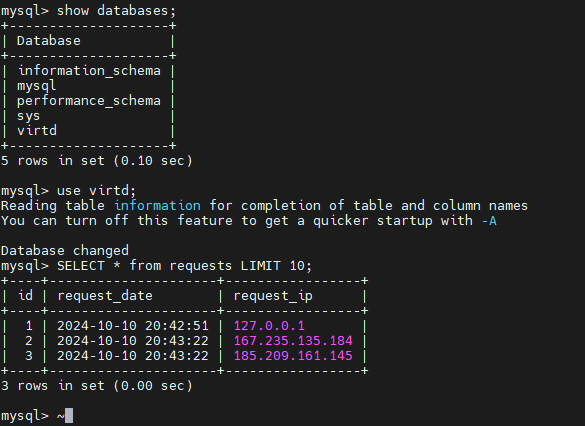

### задача 4
1.Ссылка на fork https://github.com/mishalipatnikov/shvirtd-example-python  
2. Повтор sql запроса, но в облаке  
  
3. скрипт  
#!/bin/bash  
cd /opt;  
git clone https://github.com/mishalipatnikov/shvirtd-example-python.git;  
cd /opt/shvirtd-example-python;  
docker compose up -d

### задача 6
Скачать образ, сохранить его в tar, распаковать и найти в каком слое хранится bin, переместить в /usr/local/bin и проверить версию
```
docker pull hashicorp/terraform:latest  
wget https://github.com/wagoodman/dive/releases/download/v0.12.0/dive_0.12.0_linux_amd64.tar.gz  
tar xzvf dive_0.12.0_linux_amd64.tar.gz  
dive hashicorp/terraform:latest  
docker save hashicorp/terraform:latest -o terraform_image.tar  
 mkdir /tmp/terraform_extracted  
tar -xf terraform_image.tar -C /tmp/terraform_extracted  
find /tmp/terraform_extracted -name terraform  
cd /tmp/terraform_extracted/  
ls -R  
tar -xf ./a3f6cc6ffe3f6154374e01a16a828cfebbc49d86f5ef55deff9cb3026d94c0a3/layer.tar -C /tmp/terraform_extracted/  
find /tmp/terraform_extracted/ -name terraform
cp /tmp/terraform_extracted/bin/terraform /usr/local/bin
chmod +x /usr/local/bin/terraform
terraform version
```


### задача 6.1
Всё аналогично
```
rm /usr/local/bin/terraform  
docker run -d --name terraform-container hashicorp/terraform:latest tail -f /dev/null  
docker cp terraform-container:/bin/terraform /usr/local/bin/  
chmod +x /usr/local/bin/terraform  
terraform version  
```

