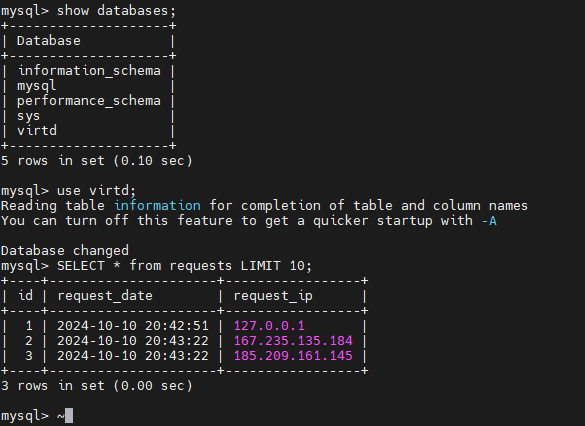

### задача 4
1.Ссылка на fork https://github.com/mishalipatnikov/shvirtd-example-python  
2. Повтор sql запроса, но в облаке  
  
3. скрипт  
#!/bin/bash  
cd /opt;  
git clone https://github.com/mishalipatnikov/shvirtd-example-python.git;  
cd /opt/shvirtd-example-python;  
docker compose up -d
