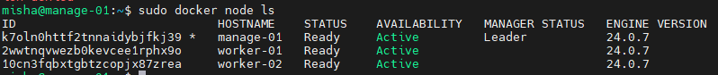

1. Создал 3 ВМ, один менеджер, два воркера  
На менеджере установил докер и создал swarm  
`docker swarm init`
2. На воркерах выполнил подключение к swarm  
```
sudo apt update -y && \
sudo apt install docker.io -y && \
sudo docker swarm join --token SWMTKN-1-token 10.129.0.33:2377
```
3. Вывод нод  

