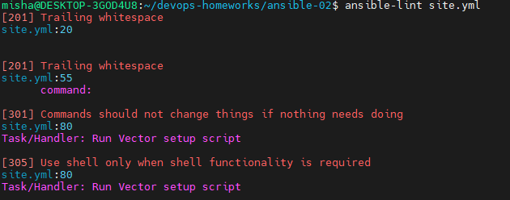
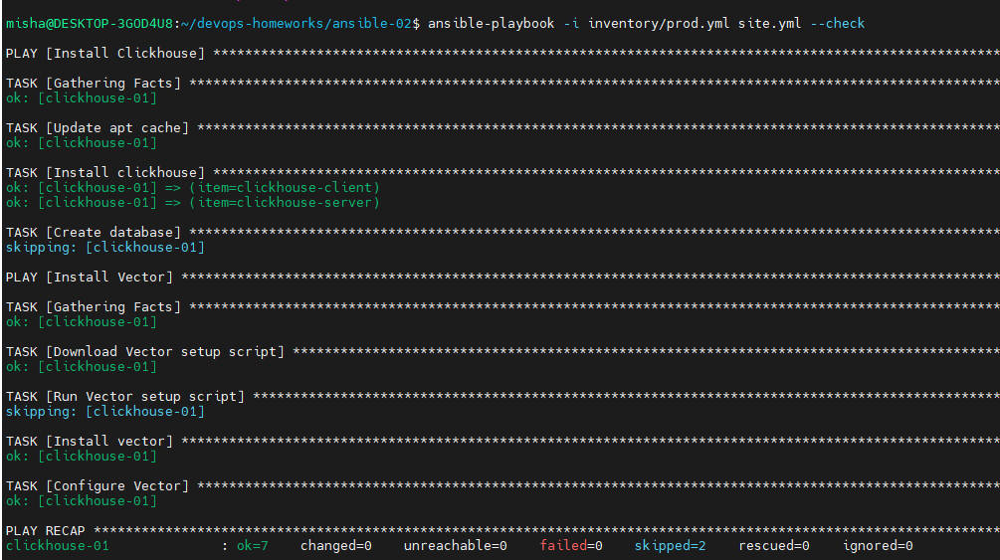
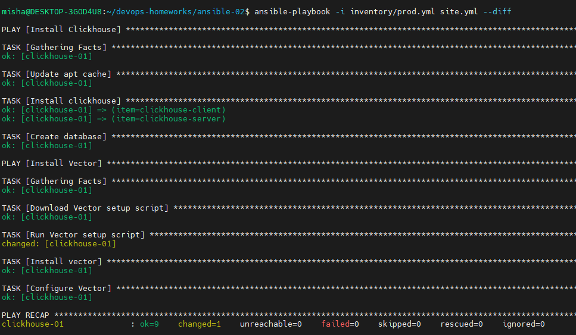

### Скриншоты
1. `ansible-lint site.yml`  

2. `ansible-playbook -i inventory/prod.yml site.yml --check`  

3. `ansible-playbook -i inventory/prod.yml site.yml --diff` 

### Описание  
1. Тут же добавил папку для терраформа, чтобы руками не создавать ВМ
2. Плейбук устанавливает на хост Clickhouse и создает БД для него, после устанавливает Vector и добавляет файл конфигурации из шаблона.  
3. В параметрах есть пакеты, которые нужно установить и их версии для RedHat. Изначально версия работали, но в репозитории Ubuntu устанавливается последняя доступная версия
4. В инвентаре надо указать ip адрес хоста, на который будут устанавливаться Vector и Clickhouse. Закинул всё на одну машину, но можно установить на разные.