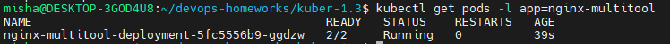
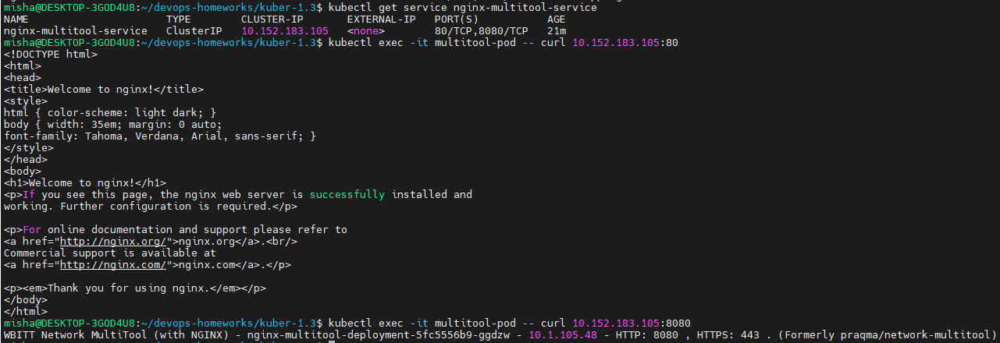
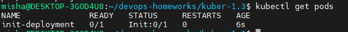
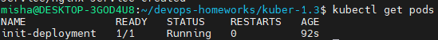

### Задание 1. Создать Deployment и обеспечить доступ к репликам приложения из другого Pod

1. Создать Deployment приложения, состоящего из двух контейнеров — nginx и multitool. Решить возникшую ошибку.
2. После запуска увеличить количество реплик работающего приложения до 2.
3. Продемонстрировать количество подов до и после масштабирования.
4. Создать Service, который обеспечит доступ до реплик приложений из п.1.
5. Создать отдельный Pod с приложением multitool и убедиться с помощью `curl`, что из пода есть доступ до приложений из п.1.

------

### Задание 2. Создать Deployment и обеспечить старт основного контейнера при выполнении условий

1. Создать Deployment приложения nginx и обеспечить старт контейнера только после того, как будет запущен сервис этого приложения.
2. Убедиться, что nginx не стартует. В качестве Init-контейнера взять busybox.
3. Создать и запустить Service. Убедиться, что Init запустился.
4. Продемонстрировать состояние пода до и после запуска сервиса.

------

### Правила приема работы

1. Домашняя работа оформляется в своем Git-репозитории в файле README.md. Выполненное домашнее задание пришлите ссылкой на .md-файл в вашем репозитории.
2. Файл README.md должен содержать скриншоты вывода необходимых команд `kubectl` и скриншоты результатов.
3. Репозиторий должен содержать файлы манифестов и ссылки на них в файле README.md.

------
### Задание 1

1. Создал [deployment](./deployment.yaml)  
Ошибка была в использовании обоими контейнерами 80 порта, закрепил за multitool порт 8080 и заново сконфигурировал.  
Ошибку искал командой  
`kubectl describe pod nginx-multitool-deployment`
2. Увеличил количество реплик до 2  
`kubectl scale deployment nginx-multitool-deployment --replicas=2`
До масштабирования  
  
После масштабирования  
  
3. Создал [multitool](./multitool.yaml), доступ до deployment  

### Задание 2
1. [deployment-init.yaml](./deployment-init.yaml) 
2. pod до создания сервиса  

3. pod после создания сервиса
