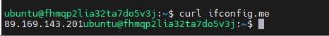

### Задача 1
1. `preemptible = true` - позволяет сделать машину прерываемой для экономии ресурсов, чтобы она самостоятельно выключилась через n-ое время, освободила ресурсы и сэкономила нам деньги.  
`core_fraction=5` - здесь указывается сколько процентов вычислительной мощности CPU мы используем для ВМ
2. 
3. 

### Задача 4
```
terraform output
vm_info = {
  "platform" = {
    "external_ip" = "51.250.86.92"
    "fqdn" = "fhmojvat0tor9ps4085m.auto.internal"
    "instance_name" = "netology-develop-platform-web"
  }
  "platform_db" = {
    "external_ip" = "51.250.9.97"
    "fqdn" = "fhmabcnoppfik65r6jqb.auto.internal"
    "instance_name" = "netology-develop-platform-db"
  }
}

```

